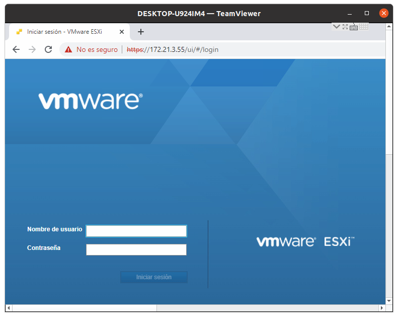

# Mantenimiento del hipervisor VMware ESXi
Este documento detalla los principales procedimientos relacionados con el mantenimiento del hipervisor [VMware ESXi](https://www.vmware.com/products/esxi-and-esx.html).

## Contenidos
- [Acerca de VMware ESXi](https://github.com/catie-ume/vmware-mantenimiento/blob/main/README.md#acerca-de-vmware-esxi)
- [Ingreso al hipervisor VMware ESXi](https://github.com/catie-ume/vmware-instalacion-mv/blob/main/README.md#ingreso-al-hipervisor-vmware-esxi)
- [Creación de una máquina virtual](https://github.com/catie-ume/vmware-instalacion-mv/blob/main/README.md#creaci%C3%B3n-de-una-m%C3%A1quina-virtual)
- [Borrado de una máquina virtual](https://github.com/catie-ume/vmware-instalacion-mv/blob/main/README.md#borrado-de-una-m%C3%A1quina-virtual)

## Acerca de VMware ESXi
[VMware ESXi](https://www.vmware.com/products/esxi-and-esx.html) es un programa de virtualización (i.e. hipervisor) para centros de datos. Contiene su propio sistema operativo, el cual proporciona, entre otros servicios, un entorno para la gestión de máquinas virtuales.

## Ingreso al hipervisor VMware ESXi
Para ingresar a la interfaz de usuario de VMware ESXi, debe accederse a la dirección , la cuál desplegará la siguiente pantalla de ingreso:

## Creación de una máquina virtual
## Borrado de una máquina virtual
